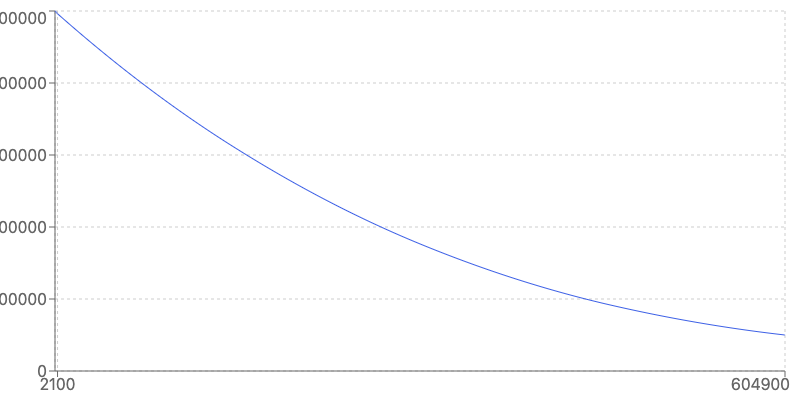

# Reserve Folio

## Overview

Reserve Folio is a protocol for creating and managing portfolios of ERC20-compliant assets entirely onchain. Folios are designed to be used as a single-source of truth for asset allocations, enabling composability of complex, multi-asset portfolios.

Folios support rebalancing via Dutch Auction over an exponential decay curve between two prices. Control flow over the auction is shared between two parties, with a `AUCTION_APPROVER` approving auctions in advance and a `AUCTION_LAUNCHER` opening them, optionally providing some amount of additional detail. Permissionless open execution is available after a delay.

`AUCTION_APPROVER` is expected to be the timelock of the rebalancing governor associated with the Folio.

`AUCTION_LAUNCHER` is expected to be a semi-trusted EOA or multisig; They can open auctions within the bounds set by governance, hopefully adding basket definition and pricing precision. If they are offline the auction can be opened permissionlessly after a preset delay. If they are evil, at-best they can deviate rebalancing within the governance-granted range, or prevent a Folio from rebalancing entirely by repeatedly closing-out auctions.

Auctions that have not expired can be re-opened up to a number of times specified by the `AUCTION_APPROVER`.

### Architecture

#### 0. **DAO Contracts**

- **FolioDAOFeeRegistry.sol**: Handles the fees associated with the broader ecosystem DAO that Folios pay into.
- **FolioVersionRegistry.sol**: Keeps track of various versions of `FolioDeployer`, owned by the DAO.

While not included directly, `FolioVersionRegistry` and `FolioDAOFeeRegistry` also depend on an existing `RoleRegistry` instance. This contract must adhere to the [contracts/interfaces/IRoleRegistry.sol](contracts/interfaces/IRoleRegistry.sol) interface.

#### 1. **Folio Contracts**

- **Folio.sol**: The primary contract in the system. Represents a portfolio of ERC20 assets, and contains auction logic that enables it to rebalance its holdings.
- **FolioDeployer.sol**: Manages the deployment of new Folio instances.
- **FolioProxy.sol**: A proxy contract for delegating calls to a Folio implementation that checks upgrades with `FolioVersionRegistry`.

#### 2. **Governance**

- **FolioGovernor.sol**: Canonical governor in the system, time-based.
- **GovernanceDeployer.sol**: Deploys staking tokens and governing systems.

#### 3. **Staking**

- **StakingVault.sol**: A vault contract that holds staked tokens and allows users to earn rewards simultaneously in multiple reward tokens. Central voting token for all types of governance.

### Roles

##### Folio

A Folio has 3 roles:

1. `DEFAULT_ADMIN_ROLE`
   - Expected: Timelock of Slow Folio Governor
   - Can add/remove assets, set fees, configure auction length, set the auction delay, and closeout auctions
   - Can configure the `AUCTION_APPROVER`/ `AUCTION_LAUNCHER`
   - Primary owner of the Folio
2. `AUCTION_APPROVER`
   - Expected: Timelock of Fast Folio Governor
   - Can approve auctions
3. `AUCTION_LAUNCHER`
   - Expected: EOA or multisig
   - Can open and close auctions, optionally altering parameters of the auction within the approved ranges

##### StakingVault

The staking vault has ONLY a single owner:

- Expected: Timelock of Community Governor
- Can add/remove reward tokens, set reward half-life, and set unstaking delay

###### Cowswap

In order to enable CowSwap on upgrade, set the Swapper (`setSwapper`) to a non-zero address. This opens a separate contract to hold the balance being swapped. As part of a pre-hook of a CowSwap order, the swap contract can be initialized with a swap balance and validate an EIP-1271 order, isolating the swap from the rest of the Folio.

However, this does require a fairly complicated external integration with the CowSwap API that submits orders to the CowSwap API whenever the CowSwap quote is more competitive than the price of a currently-live auction (as well as after supply changes).

A bundle should be constructed:

1. pre-hook: call `Folio.openSwap() returns (ISwap swap)`
2. call: CowSwap swap against the swap contract (Note this requires computing the address of the swap contract in step 1)
3. post-hook: call `swap.close()` (not required, but please do it as a nicety)

It's important to note this (optional) integration introduces a centralized dependency on CowSwap for at-flight balances being swapped. It does not _rely_ on CowSwap and they cannot in general take the backing, but they could choose to rug any balances out-on-auction.

### Rebalancing

##### Auction Lifecycle

1. Auction is approved the `AUCTION_APPROVER`, including an initial price range and a range for the basket ratios
2. Auction is opened, initiating the progression through the predetermined price curve
   a. ...either by the auction launcher (immediately, or soon after)
   b. ...or permissionlessly (after the auction delay passes)
3. Bids occur
4. Auction expires
5. (optional) Auction can be re-opened up to `availableRuns` times, going back to step 3

##### Auction Usage

###### TTL

Auctions have a time-to-live (TTL) that controls how long they can exist in an `APPROVED` state.

###### Runs

Auctions can be repeated a specified number of times, up to a maximum of `availableRuns`.

###### Dust Amounts

Bids that reduce the Folio's balance below the `minDustAmount` result in the sell token being removed from the basket. The `AUCTION_APPROVER` can use this mechanism to remove a token from the basket without explicitly calling `removeFromBasket()`.

###### Buy/Sell limits

The `AUCTION_APPROVER` configures buy and sell limits for the basket ratios, including a spot estimate:

```solidity
struct BasketRange {
  uint256 spot; // D27{tok/share}
  uint256 low; // D27{tok/share} inclusive
  uint256 high; // D27{tok/share} inclusive
}

BasketRange sellLimit; // D27{sellTok/share} min ratio of sell tokens in the basket, inclusive
BasketRange buyLimit; // D27{buyTok/share} max ratio of buy tokens in the basket, exclusive
```

During `openAuction` the `AUCTION_LAUNCHER` can set the buy and sell limits within the approved ranges provided by the `AUCTION_APPROVER`. If the auction is opened permissionlessly instead, the pre-approved spot estimates will be used instead.

###### Price

There are broadly 3 ways to parametrize `[startPrice, endPrice]`, as the `AUCTION_APPROVER`:

1. Can provide `[0, 0]` to _fully_ defer to the `AUCTION_LAUNCHER` for pricing. In this mode the auction CANNOT be opened permissionlessly. Losses can arise either due to the `AUCTION_LAUNCHER` setting `startPrice` too low, or due to precision issues from traversing too large a range. Not recommended.
2. Can provide `[startPrice, 0]` to defer to the `AUCTION_LAUNCHER` for _just_ the `endPrice`. In this mode the auction CANNOT be opened permissionlessly. Losses can arise due solely to precision issues only, assuming the `AUCTION_APPROVER` was honest in their setting of the `startPrice` and markets have not moved too much.
3. Can provide `[startPrice, endPrice]` to constrain the `AUCTION_LAUNCHER`. In this mode the auction CAN be opened permissionlessly, after a delay. Suggested default option.

The `AUCTION_LAUNCHER` can always choose to raise `startPrice` up to a limit of 100x, and `endPrice` by any amount. They cannot lower either price.

The price range (`startPrice / endPrice`) must be less than `1e9` to prevent precision issues.

###### Price Curve



Note: The first block may not have a price of exactly `startPrice`, if it does not occur on the `start` timestamp. Similarly, the `endPrice` may not be exactly `endPrice` in the final block if it does not occur on the `end` timestamp.

###### Lot Sizing

Auction lots are sized by the difference between current balances and `sellLimit` and `buyLimit`. Both correspond to Folio invariants about basket ratios that must be maintained throughout the auction:

- `sellLimit` is the min amount of sell token in the basket `D27{sellTok/share}`
- `buyLimit` is the max amount of buy token in the basket `D27{buyTok/share}`

The auction `lot()` represents the single largest quantity of sell token that can be transacted under these invariants.

In general it is possible for the `lot` to either increase and remain static over time, depending on whether `buyLimit` or `sellLimit` is the constraining factor.

###### Auction Participation

Anyone can bid in any auction in size up to and including the `lot` size. Use `getBid()` to determine the amount of buy tokens required at any given timestamp.

> `Folio.getBid(uint256 auctionId, uint256 timestamp, uint256 sellAmount) external view returns (uint256 bidAmount)`

### Fee Structure

Folios support 2 types of fees. Both have a DAO portion that work the same underlying way, placing limits on how small the fee can be.

##### `tvlFee`

**Per-unit time fee on AUM**

The DAO takes a cut with a minimum floor of 15 bps. A consequence of this is that the Folio always inflates at least 15 bps annually. If the tvl fee is set to 15 bps, then 100% of this inflation goes towards the DAO.

Max: 10% annualy

##### `mintFee`

**Fee on mints**

The DAO takes a cut with a minimum floor of 15 bps. The DAO always receives at least 15 bps of the value of the mint. If the mint fee is set to 15 bps, then 100% of the mint fee is taken by the DAO.

Max: 5%

#### Fee Floor

The universal 15 bps fee floor can be lowered by the DAO, as well as set (only lower) on a per Folio basis.

### Units

Units are documented with curly brackets (`{}`) throughout the codebase with the additional `D18` or `D27` prefixes being used to denote when additional decimals of precision have been applied, for example in the case of a ratio. Percentages are generally 18-decimal throughout the codebase while exchange rates are generally 27-decimal.

Units:

- `{tok}` OR `{share}` OR `{reward}`: token balances
- `D27`: 1e27
- `D18`: 1e18
- `D18{1}`: a percentage value with 18 decimals of added precision
- `D27{tok1/tok2}`: a ratio of two token balances with 18 decimals of added precision
- `{s}`: seconds

Example:

```
    // {share} = {share} * D18{1} / D18
    uint256 shares = (pendingFeeShares * feeRecipients[i].portion) / D18;
```

### Valid Ranges

Tokens are assumed to be within the following ranges:

|              | Folio | Folio Collateral | StakingVault | StakingVault underlying/rewards |
| ------------ | ----- | ---------------- | ------------ | ------------------------------- |
| **Supply**   | 1e36  | 1e36             | 1e36         | 1e36                            |
| **Decimals** |       | 27               |              | 21                              |

It is the job of governance to ensure the Folio supply does not grow beyond 1e36 supply.

Exchange rates / prices are permitted to be up to 1e54, and are 27 decimal fixed point numbers instead of 18.

### Weird ERC20s

Some ERC20s are NOT supported

| Weirdness                      | Folio | StakingVault |
| ------------------------------ | ----- | ------------ |
| Multiple Entrypoints           | ❌    | ❌           |
| Pausable / Blocklist           | ❌    | ❌           |
| Fee-on-transfer                | ❌    | ❌           |
| ERC777 / Callback              | ❌    | ❌           |
| Downward-rebasing              | ✅    | ❌           |
| Upward-rebasing                | ✅    | ❌           |
| Revert on zero-value transfers | ✅    | ✅           |
| Flash mint                     | ✅    | ✅           |
| Missing return values          | ✅    | ✅           |
| No revert on failure           | ✅    | ✅           |

Note: While the Folio itself is not susceptible to reentrancy, read-only reentrancy on the part of a consuming protocol is still possible for a Folio configured with a reentrant ERC20 token. To check for reentrancy, call `poke()` or `toAssets()`. Other functions also check for reentrancy but may cost more gas.

### Chain Assumptions

The chain is assumed to have block times under 60s. The `AUCTION_LAUNCHER` has 120s reserved to act first before anyone else can open an auction.

### Governance Guidelines

- If governors plan to remove a token from the basket via `Folio.removeFromBasket()`, users will only have a limited amount of time to redeem before the token becomes inaccessible. Removal should only be used if the reward token has become malicious or otherwise compromised.

### Future Work / Not Implemented Yet

1. **`delegatecall` functionality / way to claim rewards**
   currently there is no way to claim rewards, for example to claim AERO as a result of holding a staked Aerodrome position. An autocompounding layer such as beefy or yearn would be required in order to put this kind of position into a Folio
2. **alternative community governance systems**
   we would like to add alternatives in the future such as (i) NFT-based governance; and (ii) an ERC20 fair launch system

### Development

1. Required Tools:
   - Foundry
   - Node v20+
   - Yarn
2. Install Dependencies: `yarn install`
3. Build: `yarn compile`
4. Testing:
   - Basic Tests: `yarn test`
   - Extreme Tests: `yarn test:extreme`
   - All Tests: `yarn test:all`
5. Deployment:
   - Deployment: `yarn deploy --rpc-url <RPC_URL> --verify --verifier etherscan`
     Set ETHERSCAN_API_KEY env var to the API key for whichever network you're targeting (basescan, etherscan, arbiscan, etc)
