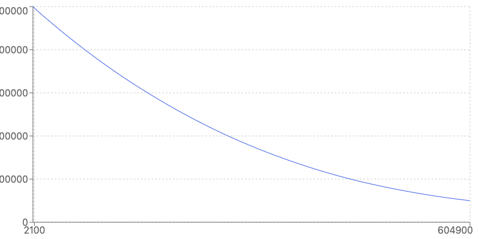

# Reserve Folio

## Overview

Reserve Folio is a protocol for creating and managing portfolios of ERC20-compliant assets entirely onchain. Folios are designed to be used as a single-source of truth for asset allocations, enabling composability of complex, multi-asset portfolios.

To change their composition, Folios support a rebalancing process during which either the `AUCTION_LAUNCHER` (or anyone else, after a delay) can open Dutch auctions to rebalance the Folio. Each Dutch auction follows an exponential decay between two price extremes under the assumption that the ideal clearing price, including slippage, lies between the price bounds. The size of each auction is defined by surpluses and deficits relative to progressively narrowing token-to-share ratios: monotonically increasing in the deficit case, and monotonically decreasing in the surplus case.

The `AUCTION_LAUNCHER` is trusted to provide additional input to the rebalance process: (i) what tokens to include in the auction; (ii) adjustments to the basket limits that are used to determine surplus/deficit; (iii) adjustments to the individual token weights in the basket unit, if `RebalanceControl.weightControl` is set; and (iv) prices, if `RebalanceControl.priceControl` is set. In all cases, the `AUCTION_LAUNCHER` is bound to act within the bounds set by the `REBALANCE_MANAGER`. If an auction is opened permissionlessly instead of by the `AUCTION_LAUNCHER`, the caller has no sway over auction details; the auction includes all tokens in the rebalance, uses the rebalance's spot weight and limit estimates, and uses the initially approved prices.

`REBALANCE_MANAGER` is expected to be the timelock of the rebalancing governor associated with the Folio. A major design goal of a Folio is to be able to achieve high fidelity asset management and rebalancing even when acting under a timelock delay.

`AUCTION_LAUNCHER` is expected to be a semi-trusted EOA or multisig. They can open auctions within the bounds set by governance, adding basket and pricing precision. If they are offline the auction can be opened through the permissionless route instead. If the `AUCTION_LAUNCHER` is actively malicious, they can maximally deviate the final portfolio within the governance-granted range or prevent a Folio from rebalancing entirely. In the case that `RebalanceControl.priceControl == PriceControl.PARTIAL`, they can additionally cause value leakage but cannot guarantee they themselves are the beneficiary; in the case that `RebalanceControl.priceControl == PriceControl.ATOMIC_SWAP`, they can cause value leakage AND make themselves the beneficiary.

There is no practical limit to how many auctions can be opened during a rebalance except for the rebalance's TTL. When the launcher window is nonzero, the `AUCTION_LAUNCHER` has the first opportunity to open auctions or close the rebalance before the permissionless (unrestricted) period begins.

### Architecture

#### 0. **DAO Contracts**

- **FolioDAOFeeRegistry.sol**: Handles the fees associated with the broader ecosystem DAO that Folios pay into.
- **FolioVersionRegistry.sol**: Keeps track of various versions of `FolioDeployer`, owned by the DAO.

While not included directly, `FolioVersionRegistry` and `FolioDAOFeeRegistry` also depend on an existing `RoleRegistry` instance. This contract must adhere to the [contracts/interfaces/IRoleRegistry.sol](contracts/interfaces/IRoleRegistry.sol) interface.

#### 1. **Folio Contracts**

- **Folio.sol**: The primary contract in the system. Represents a portfolio of ERC20 assets, and contains auction logic that enables it to rebalance its holdings.
- **FolioDeployer.sol**: Manages the deployment of new Folio instances.
- **FolioProxy.sol**: A proxy contract for delegating calls to a Folio implementation that checks upgrades with `FolioVersionRegistry`.

#### 2. **Governance**

- Governed Folios use `@reserve-protocol/reserve-governor` optimistic governance.

#### 3. **Staking**

- Staking vaults are provided by `@reserve-protocol/reserve-governor` and used as optimistic-governance voting tokens.

### Roles

##### Folio

A Folio has 3 operational roles, plus an off-chain brand role:

1. `DEFAULT_ADMIN_ROLE`
   - Expected: Folio governance timelock
   - Can add/remove assets, set fees, configure max auction length, close auctions/rebalances, and deprecate the Folio
   - Can configure the `REBALANCE_MANAGER`/ `AUCTION_LAUNCHER`
   - Primary owner of the Folio
2. `REBALANCE_MANAGER`
   - Expected: Folio governance timelock and/or approved basket managers
   - Can start rebalances, end rebalances/auctions
3. `AUCTION_LAUNCHER`
   - Expected: EOA or multisig
   - Can open and close auctions, end rebalances, and optionally set auction parameters within the approved ranges
4. `BRAND_MANAGER`
   - Expected: off-chain brand operator
   - No onchain permissions

### Rebalancing

##### Rebalance Lifecycle

1. A rebalance is started by the `REBALANCE_MANAGER`, specifying ranges for all variables (tokens, rebalance limits, token weights, and prices)
2. An auction is opened within a subset of the initially-provided ranges, either by:
   - the auction launcher, optionally adjusting rebalance limits, weights, or prices within the approved ranges
   - a permissionless caller, after the restricted period passes, using spot weights/limits and initially approved prices
3. Bids occur on any token pairs included in the auction at nonzero size
4. Auction expires

A rebalance can only have 1 auction run at a time. The `AUCTION_LAUNCHER` can always overwrite the existing auction, but an unpermissioned caller must wait for an ongoing auction to close before opening a new one. At any time the current auction can be closed or a new rebalance can be started, which also closes the running auction.

##### Rebalance Usage

###### Auction Launcher Window

Rebalances first pass through a restricted period where only the `AUCTION_LAUNCHER` can open auctions. This ensures that a configured launcher window gives the `AUCTION_LAUNCHER` time to act first. When the launcher opens an auction, the restricted period is extended far enough to cover that auction, its warmup, and a 120 second buffer. Separately, permissionless auction opening is blocked for at least 120 seconds after the rebalance starts.

###### TTL

Rebalances have a time-to-live (TTL) that controls how long the rebalance can run. Any number of auctions can be opened during this time, but the TTL itself is fixed once the rebalance starts. The `AUCTION_LAUNCHER` can extend the restricted auction-launcher window within the TTL by opening auctions near the end of that window. Note: an auction can be opened at `ttl - 1` and run beyond the rebalance's TTL.

##### Rebalance Targeting

The `REBALANCE_MANAGER` configures rebalance ranges including spot estimates to be used during fallback to the unrestricted case. A rebalance has converged when all range deltas have reached 0 for all variables in the rebalance, e.g. `low == spot == high`.

```solidity
/// Target limits for rebalancing
struct RebalanceLimits {
  uint256 low; // D18{BU/share} (0, 1e27] to buy assets up to
  uint256 spot; // D18{BU/share} (0, 1e27] point estimate to be used in the event of unrestricted caller
  uint256 high; // D18{BU/share} (0, 1e27] to sell assets down to
}

/// Range of basket weights for BU definition
struct WeightRange {
  uint256 low; // D27{tok/BU} [0, 1e54] lowest possible weight in the basket
  uint256 spot; // D27{tok/BU} [0, 1e54] point estimate to be used in the event of unrestricted caller
  uint256 high; // D27{tok/BU} [0, 1e54] highest possible weight in the basket
}

/// Individual token price ranges
/// @dev Unit of Account can be anything as long as it's consistent; nanoUSD is most common
struct PriceRange {
  uint256 low; // D27{UoA/tok} (0, 1e45]
  uint256 high; // D27{UoA/tok} (0, 1e45]
}
```

###### Rebalance Limits

On start rebalance, the `REBALANCE_MANAGER` provides a range of basket limits to target that define the path of the overall rebalance. The `low` point represents how many basket units to buy, and the `high` point represents how many basket units to sell. The `spot` point is the point estimate used in the event of an unrestricted caller. It must always lie between the `low` and `high` points.

###### Basket Weights

For each token supplied to the rebalance the `REBALANCE_MANAGER` provides `low`, `spot`, and `high` weight estimates. Similar to the rebalance limits, the `low` point represents the point to buy up to and the `high` the point to sell down to. The `spot` is the point estimate applied in the event of an unrestricted caller. It must always lie between the `low` and `high` points.

If `RebalanceControl.weightControl` is set, the `AUCTION_LAUNCHER` can help define the basket unit as the auctions progress. This is best suited for Folios targeting a particular percentage breakdown of assets over time, as opposed to Folios that have single monthly or quarterly targets that can be handled purely by rebalance limits.

###### Price

For each token supplied to the rebalance the `REBALANCE_MANAGER` must provide a `low` and `high` price estimate. These should be set such that in almost all expected scenarios, the asset's price later on secondary markets will lie within the provided range even after any timelock delays. The slippage from block-to-block price imprecision must also not be too large. The maximum allowable price range for a token is `1e2`, so the largest pairwise auction price range can span 4 orders of magnitude. This is an extreme case and not the typical usage for a Folio that wishes to maintain optimal execution.

Note: if the price of an asset goes outside its approved range, this can result in loss of value for Folio holders with value going to MEV searchers. In this case it is the job of the `AUCTION_LAUNCHER` to end the rebalance before loss can occur.

When an auction is started, the `low` and `high` prices for both assets are used to calculate a `startPrice` and `endPrice` for the auction, with the `startPrice` representing the most-optimistic price and `endPrice` representing the most-pessimistic price.

If `RebalanceControl.priceControl == PriceControl.PARTIAL`, the `AUCTION_LAUNCHER` can select a subset price range of the overall `low-high` range to use for each auction. This grants an additional responsibility to the `AUCTION_LAUNCHER` that allows them to achieve better execution but also grants them the ability to begin auctions at dishonest prices that leak value to MEV searchers once the auction starts and a gas war begins.

If `RebalanceControl.priceControl == PriceControl.ATOMIC_SWAP`, the `AUCTION_LAUNCHER` can go further and perform atomic swaps at fixed prices as long as prices are within the pre-approved `low-high` ranges. This lets an `AUCTION_LAUNCHER` set the clearing price as well as internalize MEV associated with pricing, preventing a public auction from forming. As a best practice the `AUCTION_LAUNCHER` should also end the rebalance after all fills are completed, as the final transaction in their bundle.

###### Price Curve



Note: The first block may not have a price of exactly `startPrice` if it does not occur on the `start` timestamp. Similarly, the final block may not have a price of exactly `endPrice` if it does not occur on the `end` timestamp.

###### Lot Sizing

Auctions are sized by the difference between current balances and what balance the Folio would need at the given basket `limit * weight`. Surpluses are defined relative to `RebalanceLimits.high`, while deficits are defined relative to `RebalanceLimits.low`. Each auction, the `AUCTION_LAUNCHER` is able to progressively narrow this range, until eventually an auction is run where `RebalanceLimits.high == RebalanceLimits.low` is true. Rebalancing is also informed by the spot weight at the individual token level.

The auction `sellAmount` represents the single largest quantity of sell token that can be transacted without violating the `limits` of either tokens in the pair.

In general it is possible for the `sellAmount` to either increase or decrease over time, depending on whether the surplus of the sell token or deficit of the buy token is the limiting factor.

1. If the surplus of the sell token is the limiting factor, the `sellAmount` will increase over time.
2. If the deficit of the buy token is the limiting factor, the `sellAmount` will decrease over time.

###### Auction Participation

When permissionless bids are enabled for the rebalance, anyone can bid in any auction up to and including the `sellAmount` size, as long as the `price` exchange rate is met. Trusted fills can still be used separately when trusted fillers are enabled.

```
/// @return sellAmount {sellTok} The amount of sell token on sale in the auction in the current block
/// @return bidAmount {buyTok} The amount of buy tokens required to bid for the full sell amount
/// @return price D27{buyTok/sellTok} The price in the current block as a 27-decimal fixed point
function getBid(
   uint256 auctionId,
   IERC20 sellToken,
   IERC20 buyToken,
   uint256 maxSellAmount
) external view returns (uint256 sellAmount, uint256 bidAmount, uint256 price);
```

### Fee Structure

Folios support two types of fees. Both have a DAO portion that works the same underlying way, placing limits on how small the fee can be.

##### `tvlFee`

**Per-unit time fee on AUM**

The DAO takes a cut with a chain-specific minimum floor. The default floor is 15 bps annually on Ethereum and Base, and 10 bps annually on BNB Smart Chain. A consequence of this is that the Folio inflates by at least the applicable floor while the floor is nonzero. If the TVL fee is set at or below the floor, then 100% of this inflation goes towards the DAO.

Max: 10% annually

##### `mintFee`

**Fee on mints**

The DAO takes a cut with a chain-specific minimum floor. The DAO always receives at least the applicable floor of the value of the mint. If the mint fee is set at or below the floor, then 100% of the mint fee is taken by the DAO.

Max: 5%

#### Fee Floor

The chain-specific default fee floor is capped by the DAO. Per-Folio fee floors can also be set, but they cannot exceed the default floor.

### Units

Units are documented with curly brackets (`{}`) throughout the codebase with the additional `D18` or `D27` prefixes being used to denote when additional decimals of precision have been applied, for example in the case of a ratio. Percentages are generally 18-decimal throughout the codebase while exchange rates and prices are 27-decimal.

Units:

- `{tok}` OR `{share}` OR `{reward}`: token balances
- `D27`: 1e27
- `D18`: 1e18
- `D18{1}`: a percentage value with 18 decimals of added precision
- `D27{tok/share}`: a ratio of token quanta to Folio share quanta, with 27 decimals of precision
- `D27{UoA/tok}`: a price in nanoUSD per token quanta, with 27 decimals of precision
- `D27{tok1/tok2}`: a ratio of two token balances, with 27 decimals of precision
- `{s}`: seconds

Example:

```
    // {share} = {share} * D18{1} / D18
    uint256 shares = (pendingFeeShares * feeRecipients[i].portion) / D18;

```

### Valid Ranges

Tokens are assumed to be within the following ranges:

|              | Folio | Folio Collateral |
| ------------ | ----- | ---------------- |
| **Supply**   | 1e36  | 1e36             |
| **Decimals** |       | 27               |

It is the job of governance to ensure the Folio supply does not grow beyond 1e36 supply.

Rebalance limits are permitted to be up to 1e27, and are 18 decimal fixed point numbers.

Basket weights for each token are permitted to be up to 1e54, and are 27 decimal fixed point numbers.

UoA (nanoUSD) Prices for individual tokens are permitted to be up to 1e45, and are 27 decimal fixed point numbers.

### Weird ERC20s

Some ERC20s are NOT supported

| Weirdness                      | Folio |
| ------------------------------ | ----- |
| Multiple Entrypoints           | ❌    |
| Pausable / Blocklist           | ❌    |
| Fee-on-transfer                | ❌    |
| ERC777 / Callback              | ❌    |
| Upward-rebasing                | ✅    |
| Downward-rebasing              | ✅    |
| Revert on zero-value transfers | ✅    |
| Flash mint                     | ✅    |
| Missing return values          | ✅    |
| No revert on failure           | ✅    |

> While the Folio itself is not susceptible to reentrancy, read-only reentrancy on the part of a consuming protocol is still possible. To check for reentrancy, call `stateChangeActive()` and require that both return values are false. Accounting-sensitive flows close async actions as a pre-hook, but for view functions this check is important to perform before relying on any returned data.

> While downward-rebasing and upward-rebasing tokens are generally supported, the Folio’s accounting for bought and sold token amounts relies on differences in token balances. Sold and bought token amounts can therefore be misreported if the source for the change in balance is not a transfer of tokens but a rebasing. For this reason it is discouraged to use rebasing tokens with the potential for non-incremental rebasings that lead to outsized deviations in the Folio’s accounting.

> Trusted fillers introduce their own token restrictions. If trusted fillers are enabled, the tokens used in the Folio must also be supported by the external trusted fillers that are whitelisted in the trusted filler registry.

### Chain Assumptions

The chain is assumed to have block times equal to or under 30s.

### Governance Guidelines

- `Folio.removeFromBasket()` is a manual admin escape hatch that makes a token inaccessible to mint/redeem immediately. Tokens fully sold by auctions or trusted fills are removed automatically; manual removal can be used for dust cleanup or if a token has become malicious or otherwise compromised. Manual removal does not close an outstanding trusted fill, which may settle after removal.
- If a rebalance becomes dangerous due to excessive price movement in excess of what trading governors expected, it is the duty of the `AUCTION_LAUNCHER` to end the rebalance before loss can occur.

### Releases

- [1.0.0](https://github.com/reserve-protocol/reserve-index-dtf/releases/tag/r1.0.0): Initial release: Non-repeatable pairwise auctions
- [2.0.0](https://github.com/reserve-protocol/reserve-index-dtf/releases/tag/r2.0.0): Repeatable pairwise auctions
- 3.0.0 (skipped; never deployed): Pairwise auctions around a rebalance
- 4.0.0: Basket auctions around a rebalance
- [5.0.0](https://github.com/reserve-protocol/reserve-index-dtf/releases/tag/r5.0.0): Max auction sizes, restricted permissionless bids, and brand/name controls
- 6.0.0: Optimistic governance, token allowlist controls, Folio self-fee, immutable fee recipients, custom auction lengths, and rebalance nonce validation

### Future Work / Not Implemented Yet

1. **`delegatecall` functionality / way to claim rewards**
   Currently there is no way to claim rewards, for example to claim AERO as a result of holding a staked Aerodrome position. An autocompounding layer such as Beefy or Yearn would be required in order to put this kind of position into a Folio.
2. **Alternative community governance systems**
   Future governance options could include NFT-based governance and ERC20 fair-launch systems.

### Development

1. Required Tools:
   - Foundry
   - Node v24+
   - pnpm
2. Install Dependencies: `pnpm install`
3. Build: `pnpm compile`
4. Testing:
   - Basic Tests: `pnpm test:core`
   - Fork Tests: `pnpm test:fork`
   - Extreme Tests: `pnpm test:extreme`
   - All Tests: `pnpm test:all`
   - Coverage: `forge coverage`
5. Deployment:
   - Deployment: `pnpm deploy --rpc-url <RPC_URL> --verify --verifier etherscan`
     Set `ETHERSCAN_KEY` env var to the API key for whichever network you're targeting (basescan, etherscan, bscscan, etc)
